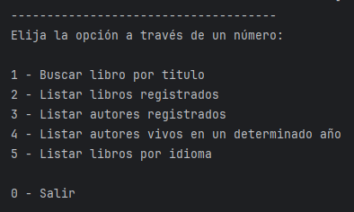
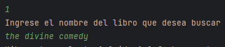
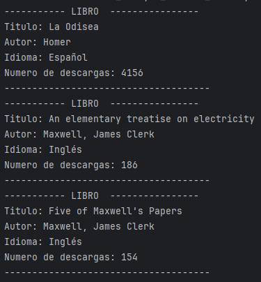
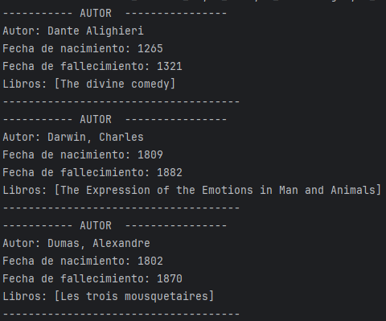

# Catálogo de libros: el LiterAlura

Este proyecto es un software en Java que permite realizar solicitudes a una API de libros, a manipular datos JSON, guardarlos en una base de datos y, finalmente, a filtrar y mostrar los libros y autores de interés. El software está diseñado para aceptar los datos por medio de la consola.

## Características

- Almacenamiento de datos en base de datos relacional SQL.
- Filtrado de datos por diferentes reglas de negocio.
- Interfaz amigable y fácil de usar visualizado en consola.

## Tecnologías Utilizadas

- Java
- Spring Boot 3
- API Gutendex
- PostgreSQL
- Jackson
- Querys SQL
- Java Persistence API

## Instalación

1. Clona el repositorio:

```
   git clone https://github.com/sebascasta14/challenge-literalura.git
```

2. Navega al directorio del proyecto:

```
   cd challenge-literalura
```

3. Abre el proyecto en el IDE de preferencia.
4. Ejecuta el programa.

## USO

1. Ingresa la opción de tu preferencia visualizada en el menu, en la consola de comandos.
2. Ingresa los datos que se soliciten dependiendo de la opción seleccionada por medio de la consola de comandos.

## Capturas de Pantalla










## Licencia

Este proyecto está bajo la Licencia MIT.

## Contacto

Para consultas o sugerencias, puedes contactarme en:

GitHub: [sebascasta14](https://github.com/sebascasta14)
LinkedIn: [Sebastian Castaneda](https://www.linkedin.com/in/sebastian-castaneda-27564b236/)